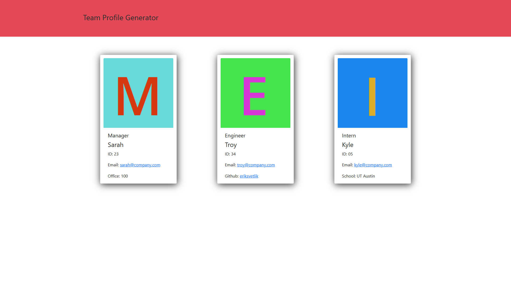

# Description

In this assignment, our task was to create and test a Node.js command-line application that receives information about employees on a development team, then generates an HTML webpage that displays a card for each employee. This application uses the [Inquirer package](https://www.npmjs.com/package/inquirer) for receiving employee information and the [Jest package](https://www.npmjs.com/package/jest) for testing.

When the user runs the application in a command-line application, they are prompted to enter manager information. Once complete, they can then enter information for an engineer or an intern if applicable. When the user has entered all employees, an index.html is generated with an information card for each entered employee.

HTML | CSS | Bootstrap | JavaScript | Node.js

# Screenshot

# Link

[Video demonstration](https://drive.google.com/file/d/1J2_Dc2tdznunp7FU8KSGI5C4YQt9znoP/view?usp=sharing)
